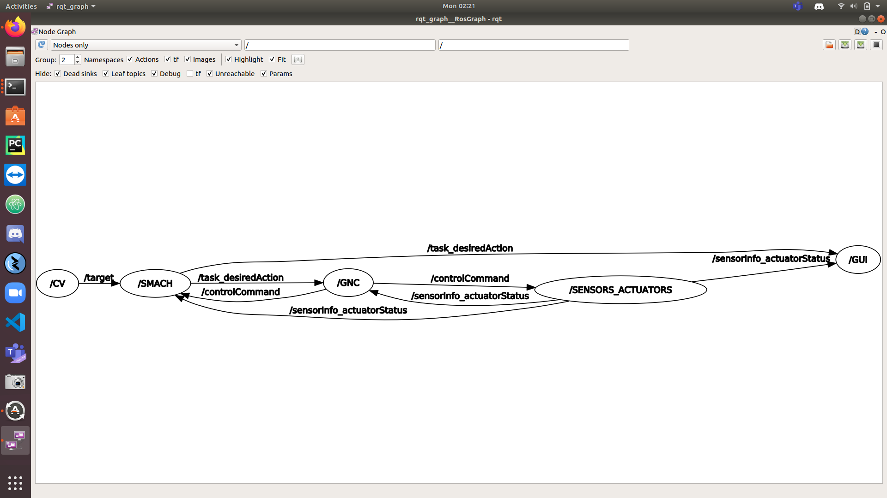

# Get Started with Jetson Nano

## How to Install ROS

1. sudo apt-get update
2. sudo apt-get -y install nano
3. sudo sh -c 'echo "deb http://packages.ros.org/ros/ubuntu $(lsb_release -sc) main" > /etc/apt/sources.list.d/ros-latest.list'
4. sudo apt install curl
5. curl -s https://raw.githubusercontent.com/ros/rosdistro/master/ros.asc | sudo apt-key add -
6. sudo apt update
7. sudo apt install ros-melodic-desktop
8. echo "source /opt/ros/melodic/setup.bash" >> ~/.bashrc
9. source ~/.bashrc
10. sudo apt install python-rosdep python-rosinstall python-rosinstall-generator python-wstool build-essential
11. sudo apt install python-rosdep
12. sudo rosdep init
13. rosdep update  

&emsp;**Check if ROS is Installed:**   
&emsp;&emsp; printenv | grep ROS

---
## How to Install this Repository

1. mkdir ~/ai_class_ws/
2. mkdir ~/ai_class_ws/src/  
3. cd ~/ai_class_ws  
4. catkin_make  
5. rm -rf src/  
6. git clone https://github.com/ArenPetrossian/Autonomous_Robotics_Class.git
7. mv Autonomous_Robotics_Class src/
8. catkin_make  
9. echo "source ~/ai_class_ws/devel/setup.bash" >> ~/.bashrc
10. source ~/.bashrc

---
## How to Install Darknet & YOLOv4-Tiny

1. cd ~/ai_class_ws/src/
2. git clone https://github.com/AlexeyAB/darknet.git 
3. cd darknet/
4. export PATH=/usr/local/cuda-10.2/bin${PATH:+:${PATH}}
5. export LD_LIBRARY_PATH=/usr/local/cuda-10.2/lib64${LD_LIBRARY_PATH:+:${LD_LIBRARY_PATH}}
6. nano Makefile
	* Set GPU --> 1
	* Set CUDNN --> 1
	* Set OpenCV --> 1
	* Set LIBSO --> 1
7. make
8. cp libdarknet.so ~/ai_class_ws/src/computer_vision/yolov4_files/
9. nano ../computer_vision/yolov4_files/camerabox.data
	* *Change “names=/home/####/ai_class_ws/...” with your username*

&emsp;**Check if Darknet is Installed:**
1. wget https://github.com/AlexeyAB/darknet/releases/download/darknet_yolo_v4_pre/yolov4-tiny.weights  
2. wget https://raw.githubusercontent.com/AlexeyAB/darknet/master/cfg/yolov4-tiny.cfg  
3. ./darknet detector demo cfg/coco.data yolov4-tiny.cfg yolov4-tiny.weights -c 0

---
## How to Install Smach Viewer

1. sudo apt-get install python-gi-cairo
2. cd ~/ai_class_ws/src/
3. git clone https://github.com/ros-visualization/executive_smach_visualization.git
4. cd ~/ai_class_ws 
5. catkin_make
6. source ~/.bashrc

&emsp; **Check if Smach Viewer is Installed:**
1. roscore
2. *In a new terminal:*  
	* python ~/ai_class_ws/src/state_machine/src/perfectCase_smach.py  
3. *In a new terminal:*  
	* rosrun smach_viewer smach_viewer.py

---
## How to Install Arduino & Rosserial

1. cd ~
2. wget https://downloads.arduino.cc/arduino-1.8.19-linuxaarch64.tar.xz
3. tar -xf arduino-1.8.19-linuxaarch64.tar.xz
4. cd arduino-1.8.19/
5. sudo bash install.sh
6. sudo apt-get install ros-melodic-rosserial-arduino
7. sudo apt-get install ros-melodic-rosserial
8. rosrun rosserial_arduino make_libraries.py ~/Arduino/libraries
9. *Open Arduino IDE on Desktop:*
	* *In Library Manager Install:*
		* "PID" by Brett Beauregard
		* "MS5837" by Blue Robotics
		* "BNO055" by Adafruit **+ Sub-Libraries**

---
## How to Run and View all Nodes

1. cd ~/ai_class_ws/src/launchers/
2. chmod +x ../computer_vision/src/cv_node.py ../graphical_user_interface/src/gui_node.py ../guidance_navigation_control/src/gnc_node.py ../sensing_and_actuation/src/sensorActuator_node.py ../state_machine/src/smach_node.py
3. *Choose an Option to Run Nodes:*
	* *Option 1: (Multiple Terminals)*
		* bash node_launcher.bash   
	* *Option 2: (Single Terminal)*
		* roslaunch node_launcher.launch
4. *In a new terminal:*  
	* rosrun rqt_graph rqt_graph   

*The output should look like the following:*

